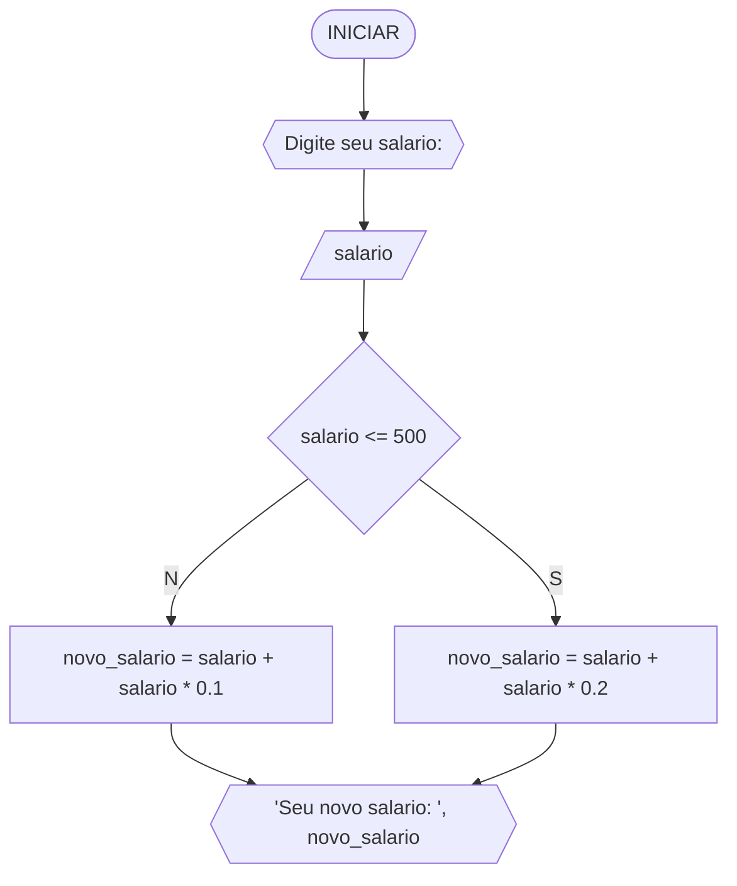
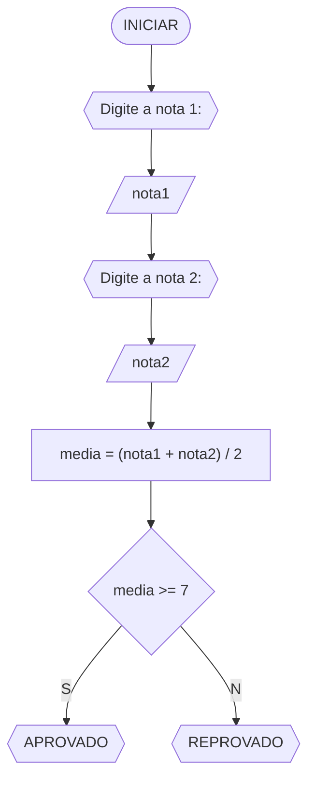
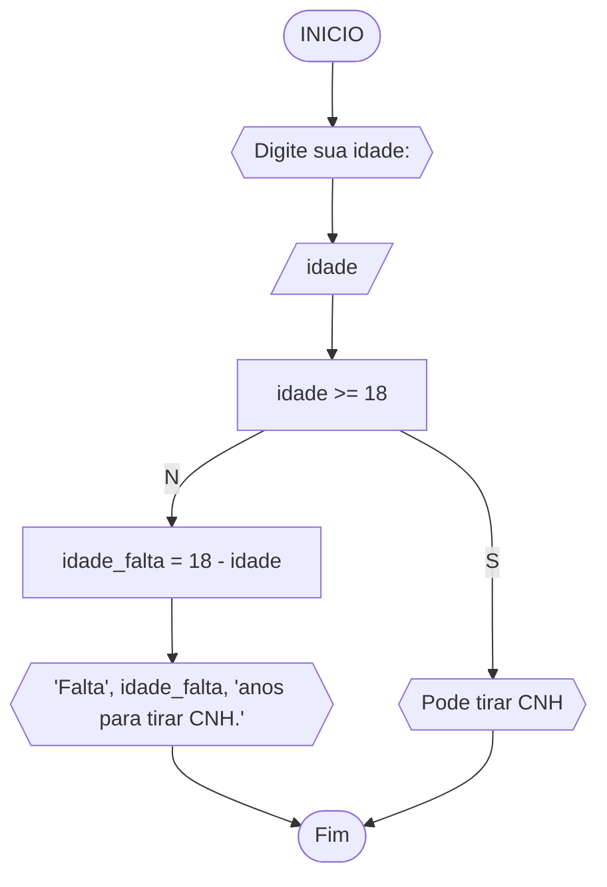

# UNIFOR
**Disciplina** raciocinio logico algoritmico <BR>
**Orientador** prof. Ricardo Carubbi

## lista 1 de exercicios

### exercicio 3
Represente, em fluxograma e pseudocódigo, um algoritmo para determinar se um numero inteiro e positivo é par ou impar.

### fluxograma

### pseudocodigo

```
ALGORITMO verifica_par_impar
DECLARE numero, resto INTEIRO
// Exibe a mensagem para entrada de dados
ESCREVA "digite um numero : "
// atribui o dado inserido a variavel
LEIA numero
SE numero >= 0 ENTAO
		resto = numero % 2
		SE resto == 0 ENTAO
				ESCREVA "o numero é par"
		SENAO
					ESCREVA "o numero é impar!"
SENAO							
			ESCREVA "o numero deve ser positivo"
FIM_ALGORITMO
```

#### Teste de mesa 
| numero | numero >= 0 | resto | resto == 0 | Saída |
| -- | -- | -- | -- | -- | 
| -1 | F |   |   | "O número deve ser postivo!" |
| 0  | V | 0 | V | "O número é par!" |
| 13 | V | 1 | F | "O número é impar!" |
| 30 | V | 0 | V | "O número é par!" |


## Exercício 02 
Represente, em fluxograma e pseudocódigo, um algoritmo para calcular o novo salário de um funcionário. 
Sabe-se que os funcionários que recebem atualmente salário de até R$ 500 terão aumento de 20%; os demais terão aumento de 10%.

#### Fluxograma 



#### Pseudocódigo 

```
Algoritmo ContaAprovacoes
DECLARAR salario, novo_salario: REAL
// mostra a mensagem para entrada de dados na variavel
ESCREVA "Digite seu salario: "
// atribui o dado inserido a variavel
LEIA salario
SE salario <= 500 ENTAO  
	novo_salario = salario + salario * 0.2
	ESCREVA "Seu novo salario: R$", novo_salario
SENAO
	novo_salario = salario + salario * 0.1
	ESCREVA "Seu novo salario: R$", novo_salario
FIM
```

#### Teste de mesa 

|Entrada|Saída| 
|      --      |      --      |
|750|Seu novo salario: R$825,00|
|400|Seu novo salario: R$480,00|
|500|Seu novo salario: R$600,00|


## Exercício 03 
Represente, em fluxograma e pseudocódigo, um algoritmo para calcular a média aritmética entre duas notas de um aluno e mostrar sua situação, que pode ser aprovado ou reprovado.

### Fluxograma 


### Pseudocódigo 

```
Algoritmo ContaAprovacoes
DECLARE nota1, nota2, media: REAL
ESCREVA "Digite a nota 1:" 
LEIA nota1
ESCREVA "Digite a nota 2:" 
LEIA nota2
media = (nota1 + nota2) / 2
SE media >= 7 ENTAO
	ESCREVA("APROVADO")
SENAO
	ESCREVA("REPROVADO")
```

### Teste de mesa 

|Nota1|Nota2|Saída|
|  -  |  -  |  -  | 
| 5 | 8.5 |REPROVADO|
|8|9.3|APROVADO|
|10|5.5|APROVADO|

## Exercício 04 
Represente, em fluxograma e pseudocódigo, um algoritmo que, a partir da idade do candidato(a), determinar se pode ou não tirar a CNH. 
Caso não atender a restrição de idade, calcular quantos anos faltam para o candidato estar apto.

#### Fluxograma 



#### Pseudocódigo 

```
Algoritmo ContaAprovacoes
DECLARAR idade, idade_falta: INTEIRO
ESCREVA "Digite sua idade: "
LEIA idade
SE idade >= 18 ENTAO
	ESCREVA "Pode tirar CNH"
SENAO
	idade_falta = 18 - idade
	ESCREVA "Falta ", idade_falta, " anos para tirar CNH"
FIM
```

#### Teste de mesa 

| Entrada | Saída |
|      --      |      --      | 
| 20     | Pode tirar CNH      |
| 14   |Falta 4 anos para tirar CNH|
|17|Falta 1 anos para tirar CNH|


