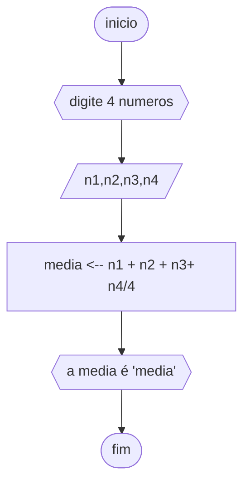
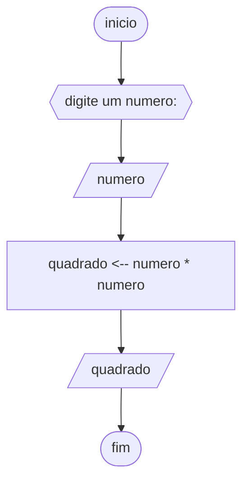

# UNIFOR
**Disciplina** raciocinio logico algoritmico <BR>
**Orientador** prof. Ricardo Carubbi

## lista 1 de exercicios

### exercicio 3
Represente, em fluxograma e pseudocódigo, um algoritmo para determinar se um numero inteiro e positivo é par ou impar.

### fluxograma

### pseudocodigo

```
ALGORITMO verifica_par_impar
DECLARE numero, resto INTEIRO
ESCREVA "digite um numero : "
LEIA numero
SE numero >= 0 ENTAO
		resto = numero % 2
		SE resto == 0 ENTAO
				ESCREVA "o numero é par"
		SENAO
					ESCREVA "o numero é impar!"
SENAO							
			ESCREVA "o numero deve ser positivo"
FIM_ALGORITMO
```

# UNIFOR
**DISCIPLINA**  RECIOCINIO LOGICO ALGORITMICO
**ORIENTADOR** Ricardo Carubbi
## lista de exercicios 2
### exercicio 1 
calcule a media de quatro numeros inteiros

### pseudocodigo
```
ALGORITMO calcular_media
DECLARE n1, n2, n3, n4, media INTEIRO
ESCREVA "Digite sua primeira nota: "
LEIA n1
ESCREVA "digite sua segunda nota: "
LEIA n2
ESCREVA "digite sua terceira nota: "
LEIA n3
ESCREVA "digite sua quarta nota: "
LEIA n4
media <-- (n1 + n2 + n3 + n4) / 4
ESCREVA "sua media é: ", media
```
### fluxograma



### pseudocodigo
### exercicio numero 5
calcule o quadrado de um numero

```
ALGORITMO calcular_quadrado
DECLARE numero, quadrado INTEIRO
ESCREVA "digite um numero"
LEIA numero
quadrado <-- numero * numero
ESCREVA "o quadrado de ", numero, " é: ", quadrado
```

### fluxograma

### exercicio numero 2
Leia uma temperatura dada na escala Celsius (C) e imprima o equivalente em Fahrenheit (F)
### pseudocodigo
```
ALGORITMO converter_C_F
DECLARE c, f REAL
ESCREVA "digite a temperatura em fahrenheit: "
LEIA f
c <-- 5/9 * (f - 32)
ESCREVA "a temperatura em celsius é: ", c)
```
