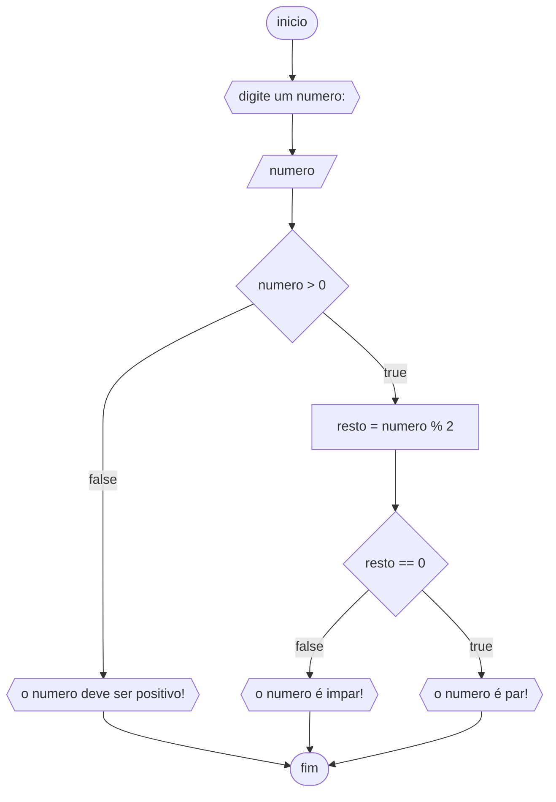

# UNIFOR
**Disciplina** raciocinio logico algoritmico <BR>
**Orientador** prof. Ricardo Carubbi

## lista 1 de exercicios

### exercicio 3
Represente, em fluxograma e pseudocódigo, um algoritmo para determinar se um numero inteiro e positivo é par ou impar.

### fluxograma



```
ALGORITMO verifica_par_impar
DECLARE numero, resto INTEIRO
ESCREVA "digite um numero : "
LEIA numero
SE numero >= 0 ENTAO
		resto = numero % 2
		SE resto == 0 ENTAO
				ESCREVA "o numero é par"
		SENAO
					ESCREVA "o numero é impar!"
SENAO							
			ESCREVA "o numero deve ser positivo"
FIM_ALGORITMO
```


